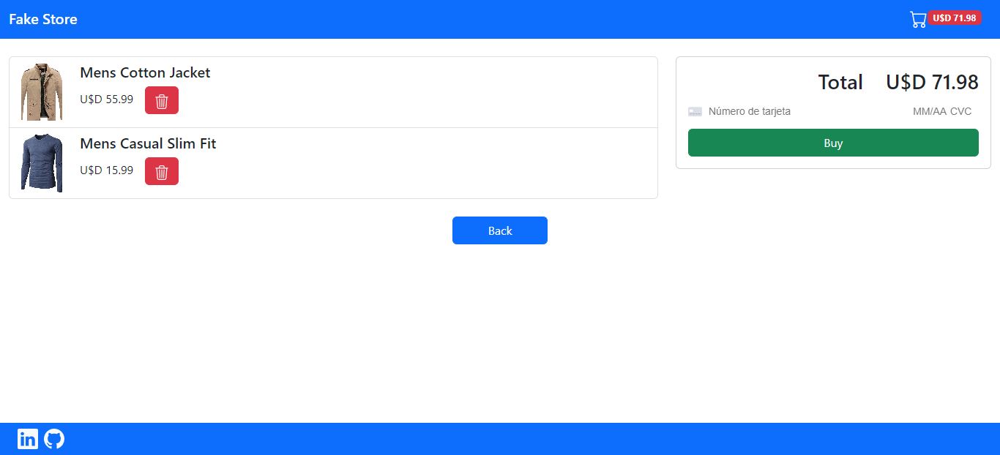

<h1 align="center">
  Fake Store
</h1>

Aplicación web que implementa una pasarela de pagos con Stripe.

## Como usar

- Clonar el repositorio: `git clone https://github.com/luiz-22/payment-gateway-stripe.git`
- En la carpeta api: `npm i`
- En la carpeta client: `npm i`
- Crear una cuenta en Stripe y usar la keys que les provee para su funcionamiento.

## Boilerplate

El boilerplate contine el código, para guardar los registro en una base de datos Postgres a través de Sequelize, si así lo desea.

## Tecnologías usadas

- Stripe
- React
- Redux
- Express
- Local Storage